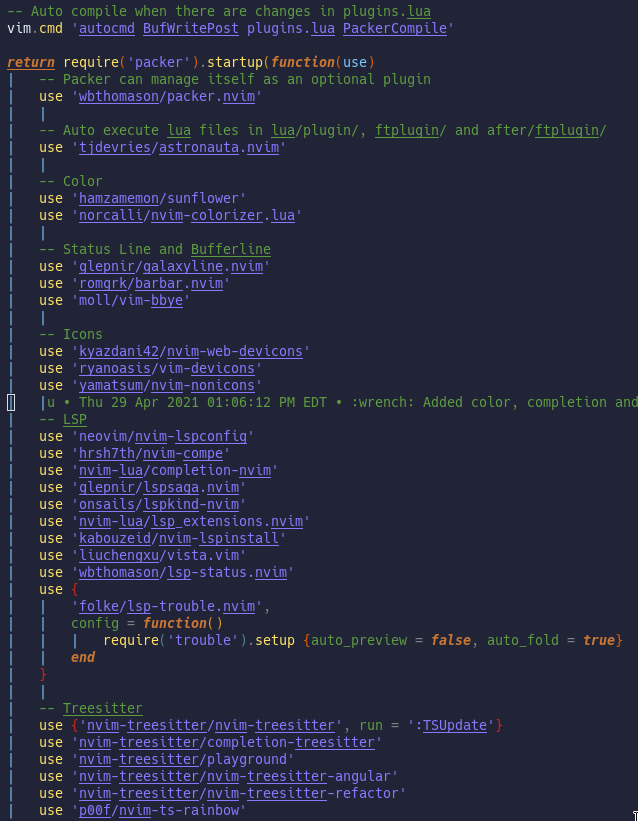

# 🌻 Sunflower



## Features

Sunflower is a bright and floral colorscheme written in Lua for Neovim with
support for native LSP, Treesitter, etc.

-   Supported plugins:
    -   [TreeSitter](https://github.com/nvim-treesitter/nvim-treesitter)
    -   [LSP Diagnostics](https://github.com/neovim/nvim-lspconfig)
    -   [LSP Trouble](https://github.com/folke/trouble.nvim)
    -   [Neogit](https://github.com/TimUntersberger/neogit)
    -   [Git Gutter](https://github.com/airblade/vim-gitgutter)
    -   [Git Signs](https://github.com/lewis6991/gitsigns.nvim)
    -   [Telescope](https://github.com/nvim-telescope/telescope.nvim)
    -   [Nvim-Tree](https://github.com/kyazdani42/nvim-tree.lua)
    -   [Lsp Saga](https://github.com/glepnir/lspsaga.nvim)
    -   [Indent-Blankline](https://github.com/lukas-reineke/indent-blankline.nvim)

## Requirements

-   Neovim >= 0.5.0

## Installation

Install via your favourite package manager:

```vim
" If you are using Vim-Plug
Plug 'hamzamemon/sunflower'
```

```lua
-- If you are using Packer
use 'hamzamemon/sunflower'
```

## Usage

Enable the colorscheme:

```vim
" Vim-Script:
colorscheme sunflower
```

```lua
-- Lua:
vim.cmd('colorscheme sunflower')
```
